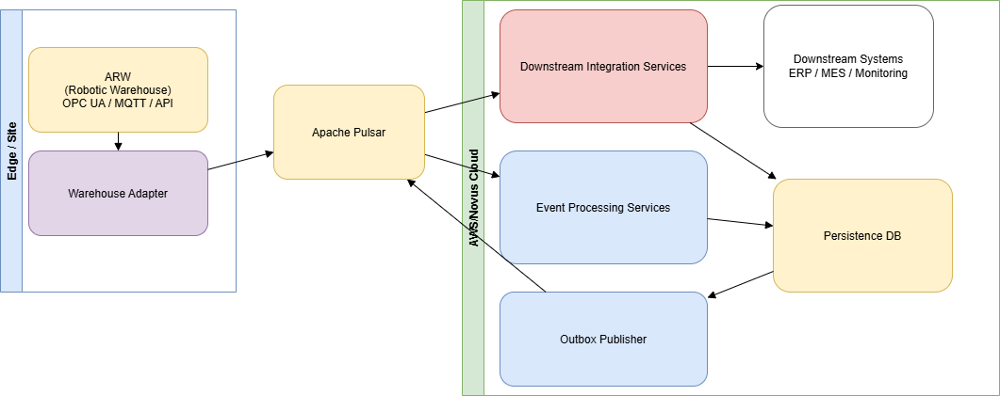

# Case for Engineering Role in Warehousing & Site Logistics

## 1. Assumptions of the problem

- The system is integrating with an event-driven warehouse
- The events can represent:
  - Inventory state change
  - Robot movement
  - Storaging/retrival action
  - Operational events (errors, retries, maintenance)
- Real-time, continous operation is assumed
- Failures can delay:
  - Production
  - Inventory mismatches
  - Safety hazards or operational inefficiencies

## 2. Assumptions taken into consideration for the proposed solution

- The ARW system has a machine-readable interface::
  - OPC-UA servers
  - MQTT brokers
  - vendor API
- The events are immutable and timestamped
- A stable ordering of events is possible through available keys (e.g., timestamps, sequence numbers, IDs)
- Event order is meaningful
- Duplicate events are possible
  - Retries
  - Reconnects
  - Same event can be sent multiple times
- ARW system is capable of some level of retention of events
  - Keeping a local history/buffer of emitted events
  - Retention should be based on acknowledgement from the consuming system:
    - But can be time based (last N mintues/hours)
    - Or could be size based (last N events)
- The FIFO need is assumed to be a FIFO per correlated key
  - E.g., per robot, per inventory item, per storage location
  - This assumption is made due to a global FIFO would directly impact parallelism

## 3. Proposed Key Architectural Components

### 3.1 ARW Adapter (Ingress)
The ingress point for event from the ARW system. A lightweight service running in Novus or on an Edge device.
- Responsibility:
  - Connects to the ARW through the source (API, OPC-UA, MQTT)
  - Validates, normalizes and (if needed) enriches incoming events into standardized structures (wrappers)
    - Standardized structures are needed to decouple the ARW specifics from the rest of the vendor/protocol specifics
  - Pushes events to the Event Handler
  - The adapter acknowledges to ARW only after it has safely handed off the event to Event Handler
- Technology considerations:
  - A microservice or serverless function
  - GoLang for implementation due to performance and concurrency needs
    - Low latency, good concurrency, simple deployment
  - Containerized for easy deployment and scaling
    - Once containerized, can be deployed on Kubernetes (ArgoCD Novus) or can be deployed to an EMMA device
    - Kubernetes deployment allows for easy scaling and management
    - EMMA device deployment allows for edge processing and low-latency needs
- Persistence:
  - Primary goal would be to have the ARW persisting in the case the adapter does not acknowledge that the event was sent to the Pulsar topic
  - Checkpoints:
    - Persist a per-source resume cursor (sequence/offset/timestamp) to continue from the correct position after restarts.
    - For Kubernetes: a small Postgres table should be enough to store cursors
    - For EMMA device: a lightweight SQLite or JSON file could store the needed cursors
  - Queuing, in case of Pulsar in unavailable:
    - In-memory queuing should be enough to handle bursts
    - If more durability is needed, a lightweight embedded queue (e.g., NATS embedded, or SQLite based queue) could be used

### 3.2 Event Handler (Broker)
A streaming broker such as a Pulsar  broker (Already available to us with high availability and scalability)
- Responsibility:
  - Durable, ready for event streaming
  - Partitioned, ready for parallelism
  - Retention natively supported
  - Consumers are scalable easily
- Technology considerations:
  - Pulsar broker
    - Partitionable based on correlation key to support FIFO
    - Durable storage for event retention
    - DLQ support for failed events
- Persistence:
  - Events are durably stored in the Pulsar broker
  - Retention policies can be configured based on business needs (e.g., time-based, size-based)
  - DLQ for handling failed events

### 3.3 Event Processing Services (Microservices)
Microservices erected to consume events from Event Handler
- Responsibility:
  - Consumes events
  - Performs idempotent processing
    - Detect any duplicates based on event IDs or hashes
  - Provides scalability based on needs
  - Applying business requirements and meaning
    - e.g., updating inventory state, triggering robot actions, logging operational events
  - Emitting follow-up events to Outbox Publisher (outbox table)
  - Handling Invalid, unexpected cases
- Technology considerations:
  - Since events are projected to 100 events/second: Python is considered
    - Faster iteration, rich tooling, async client and efficient DB operations are given
    - Python enables the prospect to integrate with Databricks (Nexus)
- Persistence:
  - Each service can have its own database or can share a common database
  - Use of relational databases (PostgreSQL, MySQL) or NoSQL databases (MongoDB, Cassandra) based on the data model and access patterns

### 3.4 Outbox Publisher
Getting rid of the dual write problem by implementing the Outbox pattern
- Responsibility:
  - Consumes follow-up events from Event Processing Services
  - Consumes the Outbox table in a reliable manner
  - Creates persistence in case of follow-up events
- Technology considerations:
  - Microservice for implementing the outbox pattern
  - Python of GoLang for implementation
    - Python if tight integration with Event Processing Services is needed
    - GoLang if performance and concurrency is a concern
- Persistence:
  - Outbox table in the database of Event Processing Services should be enough

### 3.5 Downstream Integration services
Taking the platform events and deliver them to other systems/users
- Responsibility:
  - Consumes events from Outbox Publisher
  - Integrates with downstream systems (ERP, MES, Monitoring systems)
  - Ensures delivery guarantees (at-least-once, exactly-once)
- Technology considerations:
  - Microservices or serverless functions
  - Language choice based on downstream system requirements and team expertise (I would go with GoLang)
- Persistence:
  - Durable storage for tracking delivery status and retries
  - Use of relational databases or NoSQL databases based on the data model and access patterns

### 3.6 Architecture Diagram
The previously described components can be seen visualized in the following diagram:

## 4. Data Flow
The imaginary DataFlow of the components described above can be summarized as follows:

## 5. Failure Scenarios
These Failure Scenarios are only examples which were considered during the planning of the ADR.

### 5.1 ARW Connection failure
The wors failure scenario when the ARW system is unreachable.
Detectable by Adapter connection error state, or if available, an adapter heartbeat.
- Mitigation:
  - Automatic reconnection attempts
  - Resume from checkpoint cursor, or if ARW is retaining events, resume from last acknowledged event
- EMMA device positive:
  - Easy to write a continuous service which can try reconnection and service restart upon crash.

### 5.2 Adapter crash/restart
Temporary ingestion stop and possible reprocessing could be caused.
Detectable by either: K8s restarting, or EMMA device watchdog
- Mitigation:
  - Checkpoint cursor is persisted
  - Upon restart, the adapter resumes from the last checkpoint cursor
  - Duplicates are accepted as idempotency is handled downstream
- EMMA device positive:
  - Easy to write a continuous service which can try reconnection and service restart upon crash.

### 5.3 Network Failure between Adapter and Pulsar
Adapter cannot reach Pulsar broker, events are accumulated on the adapter side.
Detection can be by publish failure, global notices
- Mitigation:
  - ACK ARW only after broker-ack’d publish to Pulsar
  - Short outages: in-memory queue absorbs bursts
  - Longer outages: optional durable embedded queue (SQLite/NATS) to persist until Pulsar returns

### 5.4 Pulsar Broker Unavailability
Events cannot be published or consumed.
Detectable by publish/consume failures, global notices

Mitigation is same as Section 5.3
- Pulsar positive:
  - Highly available at us, with an uptime close to 99%, reducing chances of total unavailability

### 5.5 Event Processing Service crashes mid-processing
Redelivery is impending, potential duplicates.
Detectable by service restarts, if possible, redelivery count exposed to monitoring.
- Mitigation:
  - Idempotent processing in services vie IDs
  - Drastic: ack Pulsar only after processing, but increases latency and complexity

### 5.6 Outbox Publisher failure
Follow-up events are not published, potential backlog.
Detectable by monitoring outbox table size, service health checks
- Mitigation:
  - Durable outbox table
  - Retry logic in Outbox Publisher
  - Stateless publisher for easy restarts

### 5.7 Outbox table exponential growth
If Outbox Publisher fails for a long time, the outbox table can grow large.
Detectable by monitoring table size, growth rate, query latency
- Mitigation:
  - Retention policies defined and enabled on the table
  - Partition table by time to facilitate easy deletion of old entries

### 5.8 Downstream Integration becomes non-idempotent
Duplicate events can cause issues in downstream systems.
Detectable by reconciliation mismatches and duplicate detection in persistence layers
- Mitigation:
  - Use idempotency keys if possible
  - Add reconciliation job if needed.

## 6. Operational Considerations
Monitoring and alerting:

- OTEL, Elastic, IStar:
  - As part of the observability all of these tools provide an appropriate way to monitor the components
  - Metrics, logs, and traces should be collected
  - Alerts should be set up based on logs, healthy, and metrics thresholds
  - Structured Logging should be used for easier parsing and analysis
  - Separation of platform and domain logs should make it easier to monitor and debug issues

Scaling:
- Ingress:
  - The Adapter can easily be scaled horizontally if the ARW supports multiple readers
  - Primary scaling should rely on ARW retention and replay, not on forced parallelism
- Event Handler:
  - Pulsar is scalable via partitions and rokers, it is important to preserve the FIFO keys and allow parallel consumption across many keys
- Event Process Services:
  - Horizontal scalability is available via consumers up to the partition count defined by Event Handler
  - Stateless services are easier to scale
- Outbox Publisher:
  - Horizontal scalability is possible if the Outbox table is partitioned or sharded
- Downstream Integration:
  - This is the part of the system that can be scaled independently par target system
